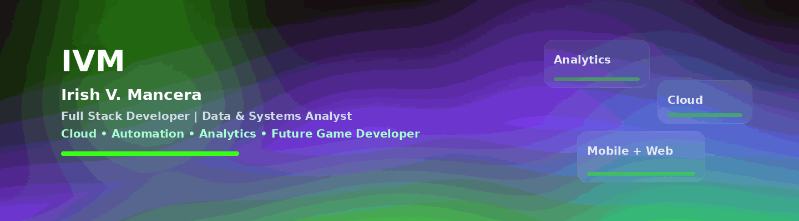
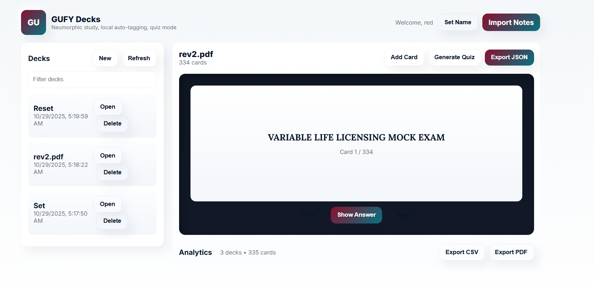
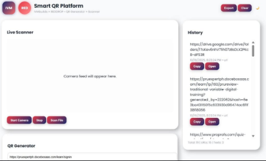
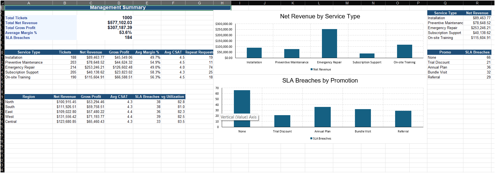
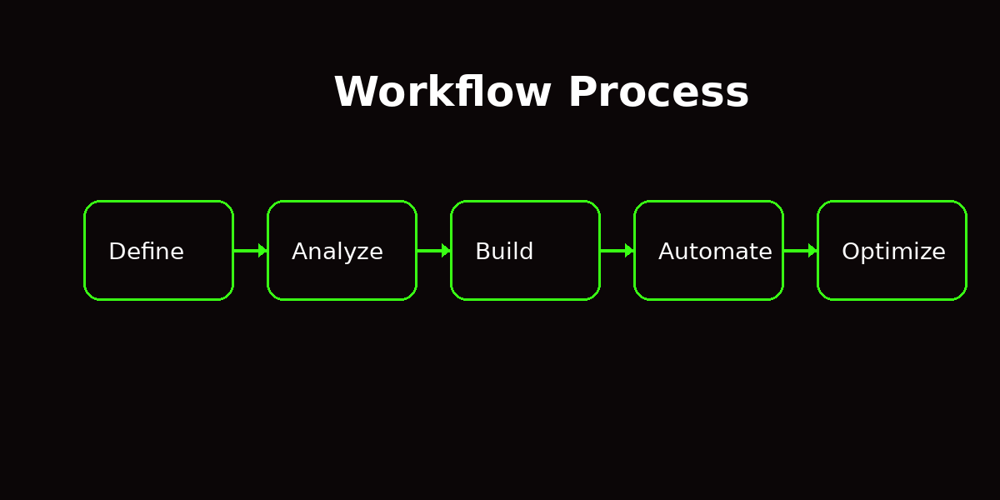
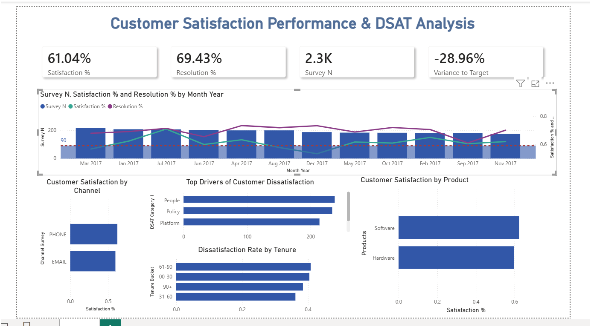
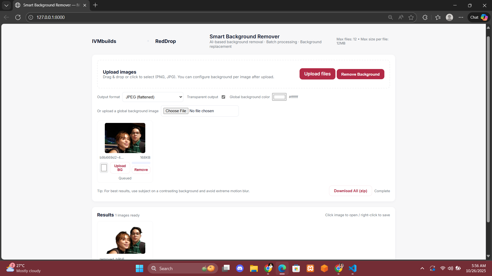
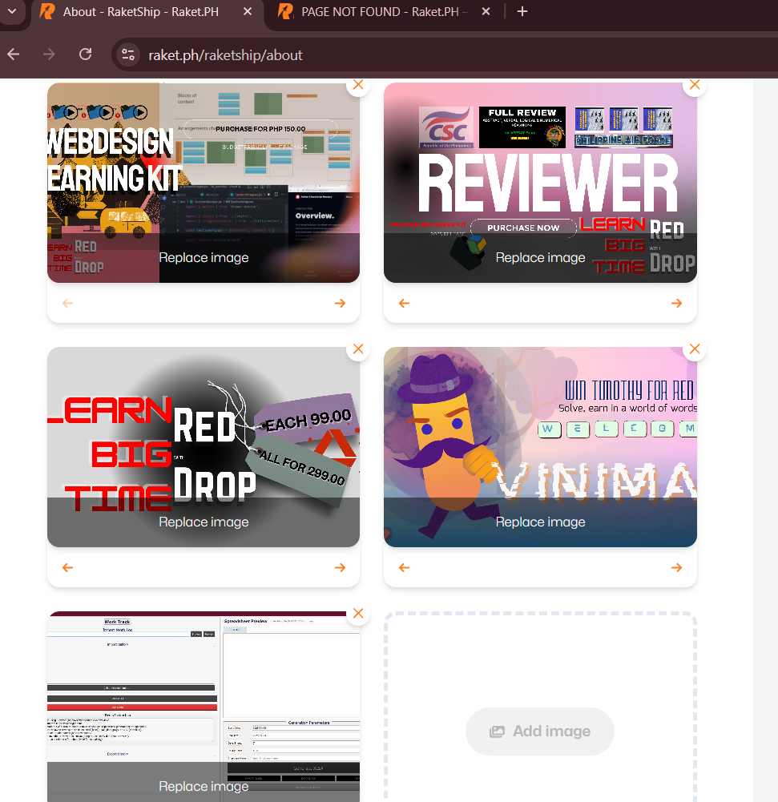

  

  <strong>Full Stack Developer • Data & Systems Analyst • SEO Strategy</strong>

  Building scalable systems, dashboards, automation workflows, and decision-ready digital solutions.

  

I build <strong>production-ready systems</strong> combining:

• Full Stack Development 
• Data & Systems Analysis 
• Automation Workflows 
• Cloud Integration

  
  
  

  
  
  

  
  DRRM System • GUFY Smart Cards • QR Scanner • Analytics Systems • Workflow Engine • Portfolio Work
  

---

## Work Experience

<table width="100%">
<tr>
<th width="20%">Preview</th>
<th width="30%">Role & Company</th>
<th width="50%">Impact • Systems • Contributions</th>
</tr>

<tr>
<td align="center" valign="middle">

</td>
<td valign="top">
<strong>Bicol University</strong> 
Junior Software Engineer 
6 Months Contract
</td>
<td valign="top">
Built <strong>iBU DRRM System</strong> 
• Real-time advisory delivery system 
• Flutter + Laravel + Firebase integration 
• API-driven notification workflows 
• Emergency communication system design 
 
<strong>Impact:</strong> Enabled structured real-time campus alerts
</td>
</tr>

<tr>
<td align="center" valign="middle">

</td>
<td valign="top">
<strong>StraStan Solutions</strong> 
Full Stack Intern (AWS) 
6 Months
</td>
<td valign="top">
⚙️ Full-stack system development 
• React + Next.js UI development 
• AWS Lambda + API Gateway + DynamoDB 
• CSV import/export systems 
• Performance optimization (lazy loading) 
 
<strong>Impact:</strong> Improved system performance & data workflows
</td>
</tr>

<tr>
<td align="center" valign="middle">

</td>
<td valign="top">
<strong>StraStan Solutions</strong> 
Sales & Marketing Trainee 
3 Months
</td>
<td valign="top">
Digital marketing operations 
• 65 SEO blogs produced 
• 195 marketing assets created 
• 360 leads generated 
• Campaign execution & reporting 
 
<strong>Impact:</strong> Strengthened digital growth pipeline
</td>
</tr>

<tr>
<td align="center" valign="middle">

</td>
<td valign="top">
<strong>Ollopa Corporation</strong> 
Documentation & Game Dev (TESDA NRG) 
 4 Months
</td>
<td valign="top">
Documentation & system design 
• Created Game Design Documents (GDD) 
• Structured technical documentation 
• Supported game workflow systems 
 
<strong>Impact:</strong> Improved system planning & documentation clarity
</td>
</tr>

<tr>
<td align="center" valign="middle">

</td>
<td valign="top">
<strong>Sogod Enterprises</strong> 
Freelance Developer / VA / Analyst 
5+ Years
</td>
<td valign="top">
Long-term system support 
• Python automation systems 
• Excel dashboards & reporting 
• Documentation & VA workflows 
• Web & business system support 
 
<strong>Impact:</strong> Delivered continuous business automation & insights
</td>
</tr>

</table>

# Data & Analytics

  <strong>KPI Dashboards • Automation • Decision Support</strong>

# Tech Stack

  

  <strong>
  Frontend • Backend • Mobile • Data • Cloud • Tools
  </strong>

## 🚀 Capability Dashboard

  
  
  
  

---

## 📊 GitHub Analytics (Live)

  
  

  

---

## 🧠 Core Skills (Compact View)

  

---

## 💼 Experience Overview (1-ROW TABLE)

<table align="center" width="100%">
<tr>
<td align="center"><b>Bicol University</b> Junior Software Engineer</td>
<td align="center"><b>StraStan</b> Full Stack Intern</td>
<td align="center"><b>StraStan</b> Marketing</td>
<td align="center"><b>Sogod Enterprises</b> Freelance (5 yrs)</td>
<td align="center"><b>Ollopa + TESDA</b> Game Dev</td>
</tr>

<tr>
<td></td>
<td></td>
<td></td>
<td></td>
<td></td>
</tr>

<tr>
<td>
• DRRM System 
• Flutter + Laravel 
• Real-time alerts
</td>
<td>
• React + Next.js 
• AWS Lambda 
• CSV + UI optimization
</td>
<td>
• 65 SEO blogs 
• 195 assets 
• 360 leads
</td>
<td>
• Python automation 
• Excel dashboards 
• Reporting systems
</td>
<td>
• Game systems 
• GDD + mechanics 
• Logic design
</td>
</tr>
</table>

---

## 🎮 Interactive / Game Systems (Portfolio Edge)

  
  

  🎯 Building interactive systems using logic, UI flow, and event-driven architecture  
  🧠 Inspired by real-world systems → applied into game mechanics  

---

## System Thinking Flow

  

  <b>Define → Analyze → Build → Automate → Optimize</b>

---

##  Featured Systems (Compact Grid)

  
  
  

  
  
  

