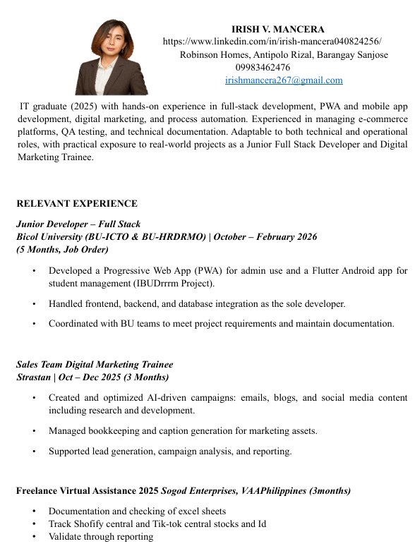
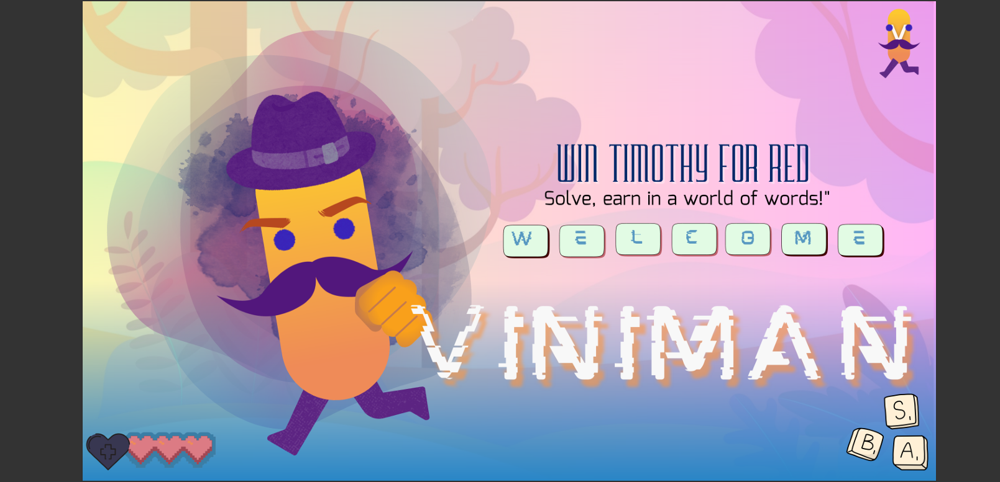
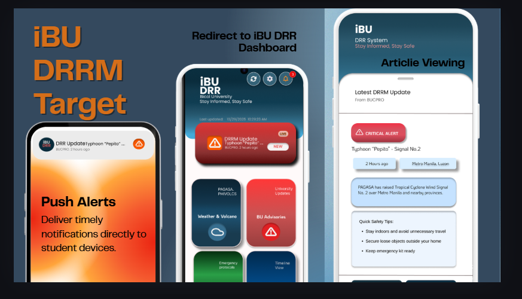
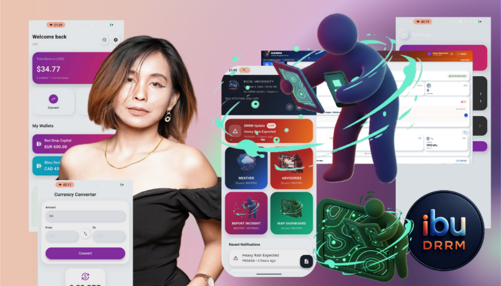

  

<h1 align="center">Irish V. Mancera</h1>

  <strong>Full Stack Developer • Data &amp; Systems Analyst • SEO Strategy</strong>

  Building scalable systems, dashboards, automation workflows, and decision-ready digital solutions with real-world impact.

  

  
  
  

---

## Enterprise Profile

I build **scalable, production-ready systems** across web, mobile, data, and automation with a focus on business operations, digital workflows, financial technology support, and decision-ready outputs.

My work sits at the intersection of:

- full stack development
- data and systems analysis
- automation and reporting
- cloud-connected application workflows
- SEO and digital support execution

---

## Selected Work

  
  

  <strong>iBU DRRM System</strong> — real-time emergency communication workflow • <strong>GUFY Smart Cards</strong> — AI-assisted notes, summaries, flashcards, and quiz workflow

 

  
  

  <strong>MicroSaaS QR Scanner</strong> — utility workflow and backend-connected processing • <strong>Analytics Systems</strong> — KPI dashboards, reporting, and structured insights

---

## Experience Highlights

<table>
  <tr>
    <td width="50%" valign="top">
      <h3>Junior Software Engineer — Bicol University</h3>
      
<strong>Stack:</strong> Flutter • Laravel • Firebase • API Integration

      <ul>
        <li>Contributed to the <strong>iBU DRRM System</strong> for real-time campus advisory delivery</li>
        <li>Worked on mobile + admin system integration</li>
        <li>Enabled structured notification delivery using cloud-connected workflows</li>
      </ul>
    </td>
    <td width="50%" valign="top">
      <h3>Full Stack Developer Intern — StraStan Solutions</h3>
      
<strong>Stack:</strong> React • Next.js • Tailwind • AWS • Postman

      <ul>
        <li>Supported frontend and system-level development using modern web tools</li>
        <li>Worked with AWS Lambda, API Gateway, and DynamoDB workflows</li>
        <li>Implemented CSV import/export, drag-and-drop, and lazy loading</li>
      </ul>
    </td>
  </tr>
  <tr>
    <td width="50%" valign="top">
      <h3>Sales &amp; Digital Marketing — StraStan Solutions</h3>
      
<strong>Focus:</strong> SEO • Visual Assets • Campaign Support • Lead Generation

      <ul>
        <li>Produced 65 SEO blogs</li>
        <li>Created 195 visual assets and 120 campaign materials</li>
        <li>Generated 360 leads through structured digital support workflows</li>
      </ul>
    </td>
    <td width="50%" valign="top">
      <h3>Freelance Developer</h3>
      
<strong>Focus:</strong> Automation • Reporting • Documentation • Logic Tools

      <ul>
        <li>Built Python automation systems and Excel reporting dashboards</li>
        <li>Created technical documentation and structured deliverables</li>
        <li>Developed .NET / C# applications for practical workflows</li>
      </ul>
    </td>
  </tr>
</table>

---

## Data & Analytics

  
  
  

  <strong>KPI Dashboards • Reporting Automation • Data Cleaning • Decision Support</strong>

I use analytics to turn raw operational data into structured outputs for reporting, monitoring, segmentation, and decision-ready visibility across business and system workflows.

---

## Monthly Development Activity

  

  Custom monthly view of development activity, system work, and technical focus.

---

## Tech Stack Ecosystem

  

  
  
  

  
  
  

---

## Resume & Credentials

  
  

  Click the preview cards to open the full documents.

---

## Workflow

  

  <strong>Define → Analyze → Build → Automate → Optimize</strong>

  This is how I approach every system I build — from problem framing to scalable execution.

---

## Future Direction

- game development
- cloud systems
- AI-integrated workflows
- scalable digital platforms

---

## Portfolio Gallery

  This gallery highlights selected outputs across systems, dashboards, UI work, learning milestones, and visual proof of execution.

 

  
  
  

  
  

---

## Contact

- LinkedIn: https://www.linkedin.com/in/irish-mancera-040824256/
- GitHub: https://github.com/IrishMancera
- Email: [irishmancera267@gmail.com](mailto:irishmancera267@gmail.com)

  

  

